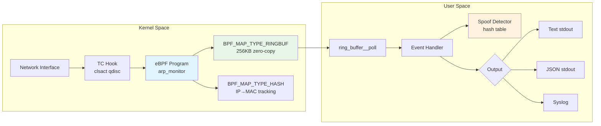

# arp-monitor-ebpf

[](https://github.com/saultab/arp-monitor-ebpf/actions/workflows/ci.yml)
[](LICENSE)
[-green.svg)]()
[]()

**A high-performance ARP traffic monitor and spoofing detector using eBPF/TC hooks.**  
Performs kernel-level packet inspection via eBPF with zero-copy ring buffer delivery to userspace — pure C implementation with no runtime overhead, no packet copying to userspace until classification is complete, and sub-microsecond event latency.

---

## Why This Project

This project demonstrates production-grade competency in:

| Skill | How It's Applied |
|-------|-----------------|
| **C Systems Programming** | Manual memory management, signal handling, hash tables, structured logging — all in pure C11 with `-Wall -Wextra -Werror` |
| **eBPF / Kernel Programming** | BPF CO-RE with vmlinux.h, TC hook attachment, ring buffer maps, hash maps, verifier-compliant packet access patterns |
| **Network Security** | ARP spoofing detection via IP→MAC tracking with flip-count thresholds to reduce false positives |
| **Performance Engineering** | Zero-copy BPF ring buffer (vs. perf_event_array), kernel-side filtering (only ARP reaches userspace), lock-free `__sync_fetch_and_add` for map updates |
| **Memory Safety in C** | Bounds-checked packet access, no buffer overflows, ASan/UBSan CI enforcement, Valgrind-clean |

---

## Tech Stack

| Component | Technology |
|-----------|-----------|
| Language | C11 (GNU extensions) |
| BPF Library | libbpf 1.x (static link) |
| BPF Tooling | bpftool (skeleton generation) |
| BPF Compiler | clang/LLVM (`-target bpf -O2`) |
| Portability | vmlinux.h / BTF / CO-RE |
| Hook Point | TC (clsact qdisc, ingress + egress) |
| Communication | `BPF_MAP_TYPE_RINGBUF` (256KB, zero-copy) |
| Detection | `BPF_MAP_TYPE_HASH` (IP→MAC kernel-side) |
| Build | GNU Make |
| CI | GitHub Actions (multi-kernel matrix) |

---

## System Requirements

### Kernel
- Linux **5.15+** with BTF support
- Required kernel configs:
  ```
  CONFIG_DEBUG_INFO_BTF=y
  CONFIG_BPF=y
  CONFIG_BPF_SYSCALL=y
  CONFIG_NET_CLS_BPF=y
  CONFIG_NET_SCH_CLSACT=y
  ```

### Capabilities
The binary requires (run as root or with capabilities):
```bash
# Option A: Run as root
sudo ./arp-monitor -i eth0

# Option B: Set capabilities (preferred)
sudo setcap cap_bpf,cap_net_admin,cap_sys_admin=eip ./arp-monitor
./arp-monitor -i eth0
```

### Tested Distributions
| Distro | Kernel | Status |
|--------|--------|--------|
| Ubuntu 22.04 | 5.15 | ✅ |
| Ubuntu 24.04 | 6.8 | ✅ |
| Fedora 39+ | 6.5+ | ✅ |
| Arch Linux | 6.x | ✅ |
| Debian 12 | 6.1 | ✅ |

### Build Dependencies

**Ubuntu / Debian:**
```bash
sudo apt-get install -y \
    clang llvm llvm-dev \
    libelf-dev zlib1g-dev \
    linux-headers-$(uname -r) \
    linux-tools-common linux-tools-$(uname -r) \
    pkg-config make git
```

**Fedora:**
```bash
sudo dnf install -y \
    clang llvm llvm-devel \
    elfutils-libelf-devel zlib-devel \
    kernel-headers kernel-devel \
    bpftool make git
```

**Arch Linux:**
```bash
sudo pacman -S clang llvm libelf zlib linux-headers bpf make git
```

---

## Installation & Build

```bash
# Clone with submodules
git clone --recursive https://github.com/saultab/arp-monitor-ebpf.git
cd arp-monitor-ebpf

# If you forgot --recursive:
git submodule update --init --recursive

# Build libbpf (static)
cd libbpf/src && make BUILD_STATIC_ONLY=1 && sudo make install && cd ../..

# Build bpftool (if not installed system-wide)
cd bpftool/src && make && sudo make install && cd ../..

# Build arp-monitor
make

# (Optional) Run unit tests
make test

# (Optional) Build with AddressSanitizer
make clean && make SANITIZE=1
```

---

## Usage

### Basic monitoring
```bash
sudo ./arp-monitor -i eth0
```

**Output:**
```
TIME      TYPE     SENDER MAC         SENDER IP        TARGET MAC         TARGET IP        FLAGS
─────────────────────────────────────────────────────────────────────────────────────────────────
14:23:01  REQUEST  aa:bb:cc:dd:ee:01  192.168.1.100    00:00:00:00:00:00  192.168.1.1      [NEW HOST]
14:23:01  REPLY    11:22:33:44:55:66  192.168.1.1      aa:bb:cc:dd:ee:01  192.168.1.100    [NEW HOST]
14:23:05  REQUEST  aa:bb:cc:dd:ee:01  192.168.1.100    00:00:00:00:00:00  192.168.1.1
14:23:12  REPLY    de:ad:be:ef:00:01  192.168.1.1      aa:bb:cc:dd:ee:01  192.168.1.100    [SPOOF ALERT flips=3]
```

### JSON output (for piping to jq, SIEM, etc.)
```bash
sudo ./arp-monitor -i eth0 --json | jq .
```

```json
{
  "timestamp": 1703001781.042,
  "opcode": "REQUEST",
  "sender_mac": "aa:bb:cc:dd:ee:01",
  "sender_ip": "192.168.1.100",
  "target_mac": "00:00:00:00:00:00",
  "target_ip": "192.168.1.1",
  "spoof_detected": false,
  "flip_count": 0,
  "new_host": true
}
```

### Verbose mode with custom threshold
```bash
sudo ./arp-monitor -i wlan0 --verbose --threshold 5
```

### Daemon mode with syslog
```bash
sudo ./arp-monitor -i eth0 --daemon --threshold 3
# Logs go to syslog: journalctl -t arp-monitor -f
```

### Inspect loaded BPF program
```bash
sudo bpftool prog show | grep arp_monitor
sudo bpftool map dump name ip_mac_map
```

### Docker
```bash
# Build
docker build -t arp-monitor .

# Run (requires --privileged for BPF + --net=host for interface access)
docker run --rm --privileged --net=host arp-monitor -i eth0

# Or with specific capabilities (more secure)
docker run --rm --cap-add=BPF --cap-add=NET_ADMIN --cap-add=SYS_ADMIN \
  --net=host arp-monitor -i eth0
```

---

## Architecture



**Data flow:**
1. **NIC** receives Ethernet frame
2. **TC hook** (clsact qdisc, ingress + egress) invokes eBPF program
3. **eBPF program** (`arp_monitor`):
   - Validates packet bounds (`data` / `data_end` pattern)
   - Filters ARP only (`ETH_P_ARP`)
   - Checks IP→MAC map for changes (`BPF_MAP_TYPE_HASH`)
   - Reserves slot in ring buffer, copies event, submits
4. **Userspace** (`ring_buffer__poll`):
   - Receives event (zero-copy from shared memory)
   - Mirrors spoof detection (for logging with context)
   - Outputs text/JSON/syslog

---

## Technical Challenges & Learnings

### BPF Verifier Constraints
- Every packet access must be bounds-checked: `if ((void *)(hdr + 1) > data_end)` before dereferencing
- The verifier tracks pointer arithmetic precisely — you cannot store `data + offset` and use it later without re-checking
- `memcpy` from libc fails verification; must use `__builtin_memcpy` or `bpf_probe_read_kernel`

### Bounded Loops & Map Operations
- BPF programs cannot have unbounded loops (pre-5.3) — all iteration must be provably finite
- `bpf_map_lookup_elem` + update pattern requires careful NULL checks
- `__sync_fetch_and_add` for atomic map value updates (concurrent access from multiple CPUs)

### BTF & CO-RE (Compile Once – Run Everywhere)
- Using `vmlinux.h` (generated from `/sys/kernel/btf/vmlinux`) instead of kernel headers
- Eliminates version-specific header dependencies
- `bpf_core_read()` handles struct layout differences across kernels

### XDP vs. TC Hooks
- XDP runs at driver level (fastest, before sk_buff allocation) but cannot see egress
- TC runs after sk_buff creation — supports both ingress and egress, which is necessary for monitoring both ARP requests (egress) and replies (ingress)
- Trade-off: TC adds ~1-2μs latency vs. XDP, but provides full bidirectional visibility

### Ring Buffer vs. Perf Event Array
- `BPF_MAP_TYPE_RINGBUF` (kernel 5.8+): shared memory, zero-copy, preserves event ordering
- `BPF_MAP_TYPE_PERF_EVENT_ARRAY`: per-CPU, requires copy, events may arrive out-of-order
- Ring buffer: single consumer poll, simpler userspace code, better for monitoring workloads

### Debugging
```bash
# BPF debug output (requires CONFIG_BPF_EVENTS=y):
sudo cat /sys/kernel/debug/tracing/trace_pipe

# In BPF code, add:
#   bpf_printk("arp_monitor: op=%d src=%x\n", arp->ar_op, ip);
```

### Build System Gotchas
- **`-pedantic` is incompatible with libbpf**: The `LIBBPF_OPTS` macro uses GCC statement expressions (`({...})`), which ISO C forbids. Use `-std=gnu11` without `-pedantic`
- **vmlinux.h provides types, not macros**: `TC_ACT_OK`, `ETH_P_ARP` etc. must be defined manually in BPF code
- **Shared headers between BPF and userspace**: Cannot use `<stdint.h>` in BPF target (pulls glibc). Use `<linux/types.h>` for userspace and vmlinux.h types (`__u8`, `__u32`) for BPF
- **Stale TC filters**: If the process is killed (SIGKILL/OOM), TC filters remain attached. Solution: `BPF_TC_F_REPLACE` on `EEXIST` during attach

---

## Limitations & Roadmap

### Current Limitations
- Single interface monitoring (no multi-interface support yet)
- Whitelist file parsing not yet implemented (`-w` flag reserved)
- No gratuitous ARP detection (only tracks request/reply MAC flips)
- Hash table (userspace) uses linear probing — may degrade with >3000 entries
- No IPv6 Neighbor Discovery support (ARP is IPv4 only)

### Roadmap
- [ ] Multi-interface monitoring
- [ ] IP-MAC whitelist loading from file
- [ ] Gratuitous ARP / ARP probe detection
- [ ] Prometheus metrics endpoint
- [ ] IPv6 Neighbor Discovery (ND) monitoring
- [ ] XDP mode for higher performance (ingress only)
- [ ] BPF CO-RE relocations for older kernels (4.x fallback)
- [ ] Systemd service unit file
- [ ] PCAP export of suspicious packets

---

## License

[MIT License](LICENSE) — Copyright (c) 2026 saultab

---

## Contact

- GitHub: [@saultab](https://github.com/saultab)
- Project: [arp-monitor-ebpf](https://github.com/saultab/arp-monitor-ebpf)
